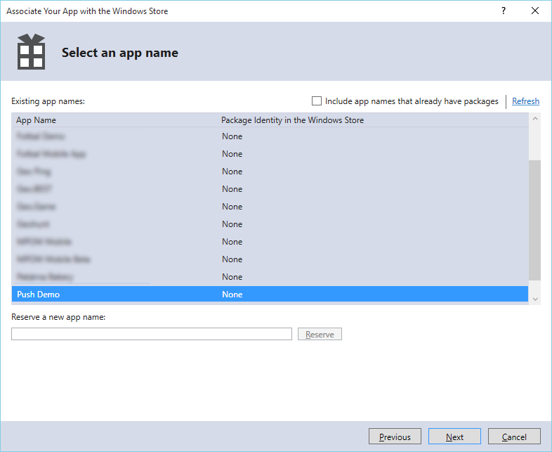
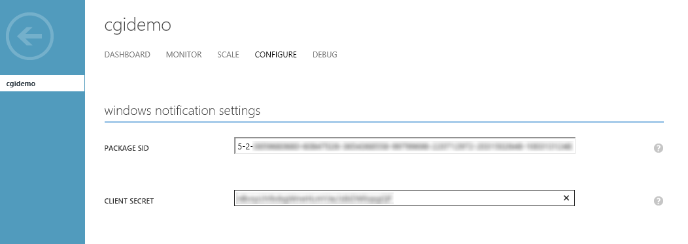

# PushClient - make it work
To make the PushClient app work, there are a few things to set up.

1. Associate the app with Windows Store. You don't need to publish it, association is sufficient.
1. Right-click on the project in Solution Explorer and select **Store -> Associate App with the Store**.


1. You'll need to log in with your Microsoft Account which has to be a Windows Store Developer Account.


1. Click **Next** and **register a new name** for the app (or associate with an existing app, if you have one).



1. Finish association.


1. Go to https://dev.windows.com.
1. Click **Dashboard** and sign in.


1. From the left menu select your new app.


1. Click **Services** and **Push notifications**.


1. Click **Live Services site**.


1. Take note of **Package SID** and **Client secret**.


1. Go to the Azure Management Portal -> Service Bus and open the namespace which contains your Notification Hub.
1. Click **CONNECTION INFORMATION** at the bottom.


1. Copy the **DefaultListenShareAccessSignature** connection string.


1. Then open your **Notification Hub** for the app (inside the same namespace).
1. Click **CONFIGURE**.
1. Fill **PACKAGE SID** and **CLIENT SECRET** with values from the Live Services portal.



1. Click **SAVE**.
1. In **Visual Studio** open PushClient -> **App.xaml.cs**.
1. Replace `[path]` with Notification Hub name and `[connection string]` with namespace connection string (DefaultListenShareAccessSignature).

```csharp
private const string notificationHubPath = "[path]";
private const string notificationHubConnectionString = "[connection string]";
```

1. Run the app.